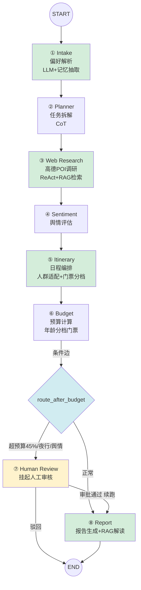

# 山海行 — 文旅多 Agent 行程规划系统 架构图详解

> 版本 v4.0 · 2026-09-05

---

## 目录

1. [总体架构（全景图）](#一总体架构全景图)
2. [请求生命周期（数据流）](#二请求生命周期数据流)
3. [Agent 编排层（DAG 拓扑）](#三agent-编排层dag-拓扑)
4. [断点续传与恢复](#四断点续传与恢复)
5. [图记忆 + 强干预](#五图记忆--强干预)
6. [人群个性化适配链路](#六人群个性化适配链路)
7. [RAG 检索增强链路](#七rag-检索增强链路)
8. [部署拓扑](#八部署拓扑)

---

## 一、总体架构（全景图）

### 1.1 ASCII 全景图

```
┌─────────────────────────────────────────────────────────────────────────────┐
│                            前端层 (React 18 + TS + AntD)                       │
│  登录注册 · 工作台 · 行程列表 · 行程详情(含地图总览+RAG检索) · 审核台 · 记忆图谱  │
│  新建行程 · 语音创建 · 对话式创建 · 11 国语言 · WebSocket 实时推送              │
└─────────────────────────────────────┬───────────────────────────────────────┘
                                      │  HTTPS (REST + WS)
┌─────────────────────────────────────▼───────────────────────────────────────┐
│                            API 网关层 (FastAPI)                               │
│                                                                               │
│   ┌────────────┐ ┌────────────┐ ┌────────────┐ ┌────────────┐ ┌───────────┐ │
│   │  auth       │ │  plans      │ │  reviews    │ │  memory     │ │  health   │ │
│   │  注册/登录  │ │  行程CRUD   │ │  审核/审批  │ │  记忆/干预  │ │  metrics  │ │
│   │            │ │  +chat对话  │ │            │ │            │ │           │ │
│   └────────────┘ └────────────┘ └────────────┘ └────────────┘ └───────────┘ │
│                                                                               │
│  中间件：JWT鉴权 · RBAC(require_role) · 统一错误码 · 请求日志                 │
│  HMAC验签 + nonce防重放（干预接口专用）                                        │
└─────────────────────────────────────┬───────────────────────────────────────┘
                                      │  入队 / 查询 / 干预
┌─────────────────────────────────────▼───────────────────────────────────────┐
│                    业务服务层 (services/)                                      │
│  AmapService(高德) · AtomicFile(原子写) · DistributedLock(锁) · Queue(队列)   │
│  Recovery(恢复) · ContentSafetyFilter(内容过滤) · InjectionDetector(注入检测)  │
└─────────────────────────────────────┬───────────────────────────────────────┘
                                      │
┌─────────────────────────────────────▼───────────────────────────────────────┐
│                  Agent 编排层 (LangGraph StateGraph + Worker)                  │
│                                                                               │
│   intake → planner → web_research → sentiment → itinerary → budget            │
│                                                          │                     │
│                                        ┌─────────────────┴────────┐           │
│                                        │ 条件边 route_after_budget │           │
│                                        └──────┬──────────┬────────┘           │
│                                               │hitl      │report              │
│                                        ┌──────▼─────┐ ┌──▼─────┐             │
│                                        │human_review│ │ report │             │
│                                        └──────┬─────┘ └──┬─────┘             │
│                                               └────END────┘                   │
│                                                                               │
│  记忆抽取(节点后) · 干预补丁(节点入口) · checkpoint(节点后)                     │
│  人群适配(itinerary 门票/购票分档) · RAG检索(web_research+itinerary)           │
│  RAG生成(report 目的地解读带溯源)                                              │
└───────┬──────────────────┬──────────────────┬───────────────────────────────┘
        │                  │                  │
┌───────▼────────┐ ┌───────▼────────┐ ┌───────▼──────────────────────────────┐
│  PostgreSQL     │ │   Redis         │ │  workspace/ 文件系统                   │
│  (pgvector)     │ │  ┌───────────┐ │ │  ┌────────────────────────────────┐   │
│  ┌───────────┐ │ │  │ Streams   │ │ │  │ workspace/{plan_id}/            │   │
│  │ 业务6表    │ │ │  │ 请求/续跑 │ │ │  │  travel_plan.md (YAML头+正文)   │   │
│  │ 图记忆4表  │ │ │  └───────────┘ │ │  │  snapshots/v{n}.md (5版快照)   │   │
│  │ (Vector)   │ │ │  ┌───────────┐ │ │  │  report.md (最终报告)           │   │
│  │ 知识库1表  │ │ │  │ 锁/心跳    │ │ │  └────────────────────────────────┘   │
│  │ (Vector)   │ │ │  │ Lua CAS    │ │ │                                       │
│  └───────────┘ │ │  └───────────┘ │ │ │                                       │
│                │ │  ┌───────────┐ │ │ │                                       │
│                │ │  │ 缓存      │ │ │ │                                       │
│                │ │  │ status    │ │ │ │                                       │
│                │ │  │ memory    │ │ │ │                                       │
│                │ │  └───────────┘ │ │ │                                       │
└────────────────┘ └────────────────┘ └────────────────────────────────────────┘
        │
┌───────▼──────────────────────────────────────────────────────────────────────┐
│                            外部数据源                                          │
│  ┌──────────────────────────┐    ┌──────────────────────────────────────┐    │
│  │ 高德地图 API              │    │ 阿里云百炼                            │    │
│  │ · geocode 地理编码/规范化 │    │ · LLM: qwen3.7-flash                 │    │
│  │ · place POI 搜索          │    │   (chat/completions)                 │    │
│  │ · direction 路径规划      │    │ · Embedding: text-embedding-v3       │    │
│  │ · weather 天气            │    │   (768维, /embeddings)               │    │
│  │ · 营业时间/评分/图片      │    │ · Rerank: qwen3.7-text-rerank        │    │
│  └──────────────────────────┘    └──────────────────────────────────────┘    │
└───────────────────────────────────────────────────────────────────────────────┘
```

### 1.2 分层解释

| 层 | 职责 | 关键约束 |
|---|---|---|
| **前端层** | 用户交互、状态展示、实时推送、表单/语音/对话录入、地图展示 | 不直连 Redis，只通过 API |
| **API 网关层** | 鉴权、参数校验、路由、验签 | 不执行 Agent 长任务，只入队/查询 |
| **业务服务层** | 可复用业务逻辑（高德/锁/文件/安全） | 无进程内长期状态 |
| **Agent 编排层** | 8 节点 DAG 执行、断点、记忆、干预、人群适配、RAG | 状态在 DB+文件+Redis，不在内存 |
| **数据层** | 持久化三件套（PG/Redis/文件）+ pgvector 向量 | PG 权威、文件恢复、Redis 热状态 |
| **外部数据源** | 真实数据（高德+百炼 LLM+Embedding+Rerank） | 带缓存 + 重试 + 降级 |

---

## 二、请求生命周期（数据流）

### 2.1 创建行程 → 出报告（主流程）

```
顾问 POST /api/plans
   │
   ├─① 鉴权(JWT) + 角色校验(advisor)
   ├─② 提交防抖(submit_lock 5s) + 幂等键
   ├─③ INSERT travel_plans(status=planning)
   │     preferences 写入：origin/destination/days/party(含成人关系+老人/儿童/学生明细)
   │                        /tags/ticket_purchase_mode/hotel_booking_mode
   ├─④ db.commit()  ★关键：先提交再入队，避免竞态
   ├─⑤ XADD stream:plan.requests
   └─⑥ 返回 201 {plan_id, status:planning}

Worker XREADGROUP（消费）
   │
   ├─⑦ UPDATE status=running
   ├─⑧ LangGraph.invoke（8 节点依次执行）
   │     intake：解析偏好(含人群明细) + 记忆抽取
   │     planner：拆解调研任务(含早餐/快餐维度)
   │     web_research：高德POI + 知识库检索(RAG)
   │     sentiment：舆情评估
   │     itinerary：日程编排 + 人群过滤 + 门票/购票分档 + 知识库检索(RAG)
   │     budget：预算计算 + 老人/儿童按年龄分档门票
   │     每节点：记忆抽取(入口) → 执行 → checkpoint(出口)
   │
   ├─⑨ 条件边判断：需 HITL？
   │      ├─ 是 → human_review 挂起 → XACK → 释放 Worker
   │      └─ 否 → report → RAG目的地解读 → 写 report.md → status=completed
   │
   └─⑩ XACK（挂起也要 ack，避免 PEL 无限重放）

主管审批（若挂起）
   ├─ POST /reviews/{id}/claim（Lua CAS 抢占）
   ├─ POST /reviews/{id}/decision（通过/驳回）
   └─ 通过 → XADD stream:plan.resume → Worker 续跑 report

前端
   ├─ GET status（压测热点，走 Redis 缓存）
   └─ WS 事件：node_done / hitl_suspended / completed
```

### 2.2 关键时序说明

**为什么"先 commit 再入队"？**

如果先入队再 commit，Worker 可能抢在 DB 事务提交前消费消息，此时查不到这条行程 → 报"行程不存在"。这是**容器化多进程才暴露的竞态**（本地单进程时序刚好躲过）。

---

## 三、Agent 编排层（DAG 拓扑）

### 3.1 Mermaid 图（DAG）



### 3.2 节点详解

| 节点 | 输入 | 输出 | 数据源 | 失败降级 | RAG |
|---|---|---|---|---|---|
| Intake | 用户 query + 结构化字段 | preferences（含人群明细） | LLM | 正则解析 | — |
| Planner | preferences | 调研任务（含早餐/快餐维度） | LLM | 内置调研维度 | — |
| Web Research | 任务列表 | 真实 POI + kb_hits | 高德 + 知识库 | 标记 failed 跳过 | ✅ 检索 |
| Sentiment | POI 列表 | 风险标签 | 规则 | 关键词打分 | — |
| Itinerary | POI + 偏好 + 出发地 | 每日行程+路线+交通+门票分档+优待备注 | 高德 + LLM + 知识库 | 无路线占位 | ✅ 检索 |
| Budget | 行程 + 天数 | 分项+总额（年龄分档） | 虚拟房价 | 固定公式 | — |
| Human Review | 风险上下文 | 挂起/放行 | — | — | — |
| Report | 全部前序 | report.md + RAG 解读 | 汇总 + LLM | 模板渲染 | ✅ 生成 |

### 3.3 条件边逻辑

```python
def route_after_budget(state):
    if state.hitl_approved:        # 审批通过续跑，直接放行
        return "report"
    if state.over_budget_ratio > 0.45:   # 超预算 45%
        return "hitl"
    if state.night_risk:                 # 高危夜行
        return "hitl"
    if state.sentiment_risk:             # 严重舆情
        return "hitl"
    return "report"
```

---

## 四、断点续传与恢复

### 4.1 状态文件结构

```
workspace/{plan_id}/travel_plan.md
┌─────────────────────────────────────────┐
│ ---                                     │
│ version: 12            ← 版本号          │
│ checksum: <sha256>     ← 正文校验和      │
│ status: running        ← 状态           │
│ resume_from: web_research:page_6        │
│ plan_id: <uuid>        ← 关联           │
│ updated_at: ...        ← 时间戳         │
│ ---                                     │
│ # Travel Plan                           │
│ ## 需求摘要                             │
│ ## Task List（任务状态表）              │
│ ## 日志                                 │
│ ## HITL 风险摘要                        │
└─────────────────────────────────────────┘
```

### 4.2 原子写入时序

```
写文件
  ├─① mkstemp 建临时文件 .tmp_xxx
  ├─② write + flush
  ├─③ os.fsync(文件)      ★内容落盘
  ├─④ os.replace(tmp, 正式) ★原子替换（Windows 用 replace 不用 rename）
  ├─⑤ os.fsync(目录)      ★保证 rename 持久化
  └─⑥ 写前先 cp 到 snapshots/v{n}.md（保留 5 版）

任何时刻崩溃：
  - 正式文件要么旧版完整、要么新版完整
  - 绝不存在"写了一半"的正式文件
  - 残留的 .tmp_* 启动时清理
```

### 4.3 崩溃恢复时序

```
Worker 启动
  ├─① recover_all()：扫描 DB 中 running/recovering
  ├─② 心跳判定：has_heartbeat? → 有则跳过（还在跑）
  ├─③ 读 travel_plan.md 的 resume_from
  ├─④ 校验 checksum → 失败回退 snapshots/ 最近版
  ├─⑤ 置 status=recovering
  ├─⑥ XADD 重新入队
  └─⑦ 消费时按 resume_from 跳过已完成任务续跑
```

**关键**：已 `completed` 且已落库的 task 不重跑（幂等），只重跑无持久化结果的当前 task。

---

## 五、图记忆 + 强干预

### 5.1 图记忆数据流（含语义向量）

```
节点产出文本（如 Intake 解析的"我香菜过敏"）
   │
   ▼
extract_and_store()
   ├─① LLM 抽取三元组（不限过敏原白名单）
   │      "我香菜过敏" → (User:用户)-[HAS_ALLERGY]->(Food:香菜)
   │      LLM 失败 → 降级规则引擎
   │
   ├─② 语义向量化：_embed() → 百炼 text-embedding-v3（768维，batch=10）
   ├─③ upsert 节点 graph_nodes（embedding 存 Vector(768)，命中即合并 version+1）
   ├─④ upsert 边 graph_edges（(src,dst,relation) 唯一）
   └─⑤ 写 memory_events 流水

检索（下一行程规划前）
   │
   ▼
retrieve(query)
   ├─① Redis 缓存命中？→ 直接返回（0.3ms）
   ├─② pgvector 余弦距离检索（embedding <=> query_vec）
   ├─③ 图拓扑：锚点实体 1 跳邻域
   └─④ 融合去重，按 confidence×距离衰减排序
```

### 5.2 强干预时序

```
主管 POST /api/memory/intervene
   │
   ├─① HMAC 验签（签名 = HMAC(key, thread_id|nonce|sha256(patch))）
   ├─② nonce 防重放（Redis SETNX，TTL 300s，重放即拒）
   ├─③ SETNX 排他锁 memory_lock:{thread_id}
   ├─④ 三写一事务：
   │     ① 图节点属性更新 version+1
   │     ② interventions 流水（含 prev_state 快照）
   │     ③ Redis state 补丁区
   ├─⑤ 释放锁
   └─⑥ WS 推送 memory_intervened + 审计 state_override

Worker 下一节点入口
   ├─ read_intervention_patch() 读补丁
   ├─ 发现补丁 → 应用（如剔除停运景点）
   └─ mark_intervention_read() 回执（成功率按回执统计）
```

---

## 六、人群个性化适配链路

### 6.1 数据录入（前端 → 后端）

```
前端（新建行程表单 / 语音创建 / 对话式创建）
  ├─ 成人关系：情侣/单身/未婚/已婚/家庭/朋友/同事
  ├─ 儿童明细：年龄 + 身高 + 是否占座（可多个）
  ├─ 老人明细：年龄 + 性别 + 生活状态（可多个）
  ├─ 学生明细：学历（可多个）
  ├─ 购票方式：一次性买票 / 分开买票
  └─ 酒店预订：一次性订 / 分开订
        │ POST /plans（party 字段）
        ▼
preferences.party = {adults, children, elders, students,
                     children_detail, elders_detail, students_detail,
                     adult_relation, elder_status}
```

### 6.2 门票分档（Itinerary + Budget）

```
ticket_prices_by_party(name, type, adults, children, elders, elders_detail, children_detail)
  ├─ 成人票 = ticket_price（基准价）
  ├─ 儿童票 = child_ticket_discount(age, height)
  │     age≤6 或 height≤1.2 → 免票(0.0)
  │     6<age<18 → 半价(0.5)
  │     age≥18 → 全价(1.0)
  └─ 老人票 = elder_ticket_discount(age)
        age≥65 → 免票(0.0)
        60≤age<65 → 半价(0.5)
        age<60 → 全价(1.0)

产出：{adult_price, child_price, elder_price, child_breakdown, elder_breakdown, note, total}
```

### 6.3 交通购票分档（Itinerary）

```
transport_ticket_prices(method, adult_price, adults, children_detail, elders, students)
  ├─ 高铁/火车：
  │     <6周岁 或 1.2米以下(不占座) → 免票
  │     6-14周岁 → 儿童优惠票(半价)
  │     ≥14周岁 → 成人全价
  ├─ 飞机：
  │     <2周岁 → 婴儿票(10%)
  │     2-12周岁 → 儿童票(5折)
  │     ≥12周岁 → 成人票
  ├─ 老人 → 成人全价（无全国统一优惠）
  └─ 学生 → 高铁仅家校往返、飞机无优惠（备注提示）

产出：{child_breakdown(含tag), note(购票提示), total}
```

### 6.4 人群过滤 + 兴趣排序（Itinerary）

```
attractions（高德真实景点）
  ├─ 购物/商场类 → 剔除（不进观光行程）
  ├─ 夜生活 → 家庭模式剔除网吧/酒吧/KTV/足浴，只留影院/剧场
  ├─ 人群过滤：
  │     有老人 → 剔除滑雪/登山/雪山/漂流/蹦极/高原
  │     有儿童 → 剔除酒吧/夜店/KTV/足浴
  └─ 排序：tag_score(兴趣标签) + party_friendly_score(亲子/老人友好)
        → 匹配兴趣、适合人群的排前面
```

### 6.5 餐饮规范（Itinerary）

```
restaurants（高德真实餐厅，含 _keyword 标签：餐厅/早餐/快餐）
  ├─ 早餐：只从"早餐/快餐"标签店选（早餐不吃火锅/烤鸭/海鲜）
  │     + 排除店名含晚餐关键词（海鲜/小龙虾/烧烤）
  ├─ 午餐：正餐类
  ├─ 晚餐：优先火锅/烧烤等
  └─ 去重：used_meals 集合跨天/跨餐次排除，三餐不重复
```

---

## 七、RAG 检索增强链路

### 7.1 完整数据流向

```
① 入库（离线）
docs/knowledge/*.md（10 篇语料）
   │ ingest_dir()
   ├─ 分块（400字 + 50字重叠）
   ├─ _embed() → 百炼 text-embedding-v3（768维，batch=10）
   └─ 写入 document_chunks 表（embedding 存 Vector(768)）

② 检索（在线，web_research + itinerary 节点入口）
查询词（目的地 + 关键词）
   │ search_kb(query, top_k)
   ├─ 向量召回：pgvector 余弦距离 top-50
   ├─ BM25 召回：关键词 top-50
   ├─ RRF 融合（Reciprocal Rank Fusion）
   ├─ rerank 精排：百炼 rerank（失败降级关键词打分）
   └─ 返回 [{doc_id, title, category, chunk_text, score, retrieval}]

③ 增强（注入节点上下文）
kb_hits → 拼进 prompt 作为参考资料（带编号 [1][2]）

④ 生成（report 节点）
_generate_rag_insights(destination, kb_hits, tags, has_elder, has_child)
   ├─ 检索到的原文 chunk 拼进 prompt
   ├─ LLM 生成「目的地深度解读」（亮点/美食/老人儿童注意事项）
   ├─ 每个信息标注来源编号 [1][2]
   └─ 末尾附「参考来源」对照表

⑤ 前端展示
行程详情「知识库检索」标签页 + Agent 流程 RAG 标记
```

### 7.2 混合检索实现

```python
# 向量召回：pgvector 余弦距离
stmt = select(DocumentChunk, DocumentChunk.embedding.cosine_distance(query_emb).label("dist"))
      .order_by(DocumentChunk.embedding.cosine_distance(query_emb))

# BM25 召回：词频-逆文档频率打分
score = _bm25_score(query, doc.chunk_text)

# RRF 融合
rrf[did] += 1.0 / (60 + rank + 1)  # 两路各贡献一次
```

### 7.3 Embedding 降级链路

```
get_llm().embed(texts)
  ├─ real 模式 + 有 key → 百炼 /embeddings（batch=10）
  ├─ 失败（400/超时）→ 降级哈希向量（保证系统能跑）
  └─ mock 模式 → 哈希向量
```

### 7.4 引用溯源

生成时 LLM 被要求在每个具体信息后标注来源编号：

```
"美食方面强烈推荐云南过桥米线[1]……早餐吃烧饵块、稀豆粉[1]……"
```

报告末尾：

```
**参考来源**
- [1] food·云南过桥米线
- [2] ticket_policy·老人优待
```

---

## 八、部署拓扑

### 8.1 Docker Compose 服务

```
                        ┌─────────────────────┐
    浏览器 ─────────────▶│  frontend (nginx)   │  端口 8080
                        │  /api → 代理 → api   │
                        └─────────┬───────────┘
                                  │（动态 DNS 解析，根治 502）
                        ┌─────────▼───────────┐
                        │  api (uvicorn)      │  端口 8001
                        │  FastAPI            │
                        └─────────┬───────────┘
                                  │
        ┌─────────────────────────┼─────────────────────────┐
        │                         │                         │
┌───────▼────────┐      ┌────────▼────────┐      ┌─────────▼────────┐
│  worker         │      │  redis          │      │  postgres        │
│  (消费队列)     │      │  Streams/锁/缓存 │      │  (pgvector)      │
│  端口 -         │      │  端口 6380       │      │  11 张表         │
└───────┬────────┘      └────────▲────────┘      │  端口 5433       │
        │                         │              └─────────▲────────┘
        │  XADD/消费              │ 缓存/锁                │ 读写+向量检索
        └─────────────────────────┴────────────────────────┘
        │
┌───────▼────────────────┐   ┌──────────────┐   ┌──────────────┐
│  workspace (volume)     │   │  prometheus   │   │  grafana      │
│  travel_plan.md 文件    │   │  端口 9091     │   │  端口 3002     │
│  knowledge (volume)     │   └──────────────┘   └──────────────┘
│  文旅知识库语料          │
└────────────────────────┘
```

### 8.2 端口映射说明

因本机常见端口（3000/8000/6379/5432）被其他项目占用，本项目统一改用：

| 服务 | 宿主机端口 | 容器内端口 |
|---|---|---|
| frontend | 8080 | 80 |
| api | 8001 | 8000 |
| redis | 6380 | 6379 |
| postgres | 5433 | 5432 |
| prometheus | 9091 | 9090 |
| grafana | 3002 | 3000 |

### 8.3 关键部署细节

1. **pgvector 镜像**：postgres 用 `pgvector/pgvector:pg15`，启动时 `CREATE EXTENSION IF NOT EXISTS vector`
2. **知识库挂载**：`./docs/knowledge` 挂载到 api/worker 的 `/app/knowledge`（只读）
3. **nginx 动态解析**：`resolver 127.0.0.11` + 变量 `proxy_pass`，避免 api 容器重建后 502
4. **健康检查**：api/postgres/redis 配 healthcheck，`depends_on condition: service_healthy`
5. **restart: unless-stopped**：进程崩溃自动拉起
6. **workspace 卷共享**：api 和 worker 挂载同一个 workspace 卷

---

## 附：技术栈清单

| 层 | 技术 |
|---|---|
| 后端 | Python 3.12 / FastAPI / Pydantic v2 / SQLAlchemy 2 (async) / LangGraph |
| 队列/缓存 | Redis Streams + Lua 脚本 |
| 数据库 | PostgreSQL 15 + pgvector（vector 0.8.6，11 张表） |
| 向量 | 百炼 text-embedding-v3（768 维） |
| LLM | 阿里云百炼 qwen3.7-flash |
| Rerank | 百炼 qwen3.7-text-rerank（降级关键词打分） |
| 前端 | React 18 / TypeScript / Vite / Ant Design |
| 地图 | 高德地图 JS API |
| 编排 | Docker Compose（7 服务） |
| 监控 | Prometheus + Grafana |
| 数据源 | 高德地图 + 阿里云百炼（LLM + Embedding + Rerank） |
