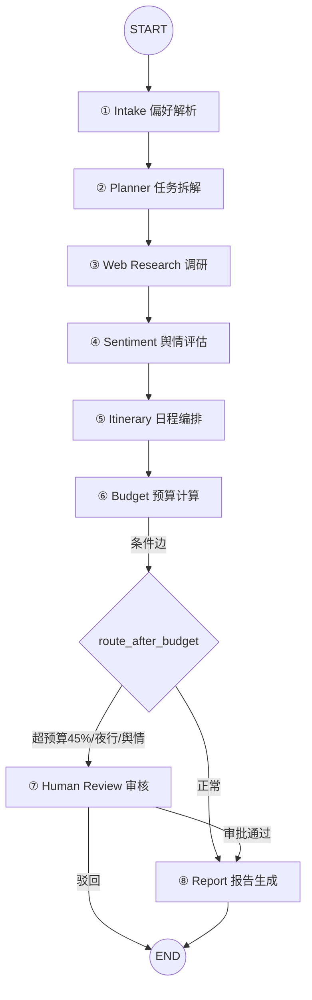

# 山海行 · 文旅多 Agent 行程规划系统 — 完整项目讲解

> 版本 v4.0 · 2026-09-05 · 1 人独立完成 · 7 人日（v1.0）+ 3 人日（工单7）+ 持续迭代

---

## 目录

1. [项目定位](#一项目定位)
2. [项目背景与痛点](#二项目背景与痛点)
3. [项目目标与需求](#三项目目标与需求)
4. [系统架构](#四系统架构)
5. [8 个 Agent 详解](#五8-个-agent-详解)
6. [核心技术实现](#六核心技术实现)
7. [人群个性化适配](#七人群个性化适配)
8. [RAG 检索增强生成](#八rag-检索增强生成)
9. [数据模型](#九数据模型)
10. [API 与前端](#十api-与前端)
11. [部署与启动](#十一部署与启动)
12. [测试与验收](#十二测试与验收)
13. [设计决策](#十三设计决策)
14. [项目亮点总结](#十四项目亮点总结)

---

## 一、项目定位

### 1.1 这是什么

**山海行**是一个**基于 8 个 AI Agent 协作的文旅资源调研与个性化行程规划系统**。

传统上，一个旅行顾问要花几小时到一整天，手动查景点、看口碑、排行程、算预算、查风险。山海行把这件事变成了：

> 用户用一句话（或一次表单、一次语音、一场对话）说出需求 → 8 个 AI Agent 自动完成「偏好解析 → 任务拆解 → 真实数据调研 → 舆情评估 → 日程编排 → 预算计算 → 风险审核 → 报告生成」→ 输出一份完整的、可执行的、带真实数据和个性化适配的行程报告。

### 1.2 三个关键标签

| 标签 | 含义 |
|---|---|
| **多 Agent** | 不是一个大模型干所有事，而是 8 个分工明确的 Agent 按 DAG 有向无环图协作 |
| **真实数据** | 景点/路线/天气/营业时间/评分全部来自高德地图 API，不是假数据拼凑 |
| **个性化** | 感知同行老人/儿童/学生，按年龄/身高分档门票、过滤景点、推荐兴趣 |

### 1.3 为什么叫「山海行」

取「山海」二字，寓意覆盖山川湖海、走遍天下的文旅愿景。品牌贯穿前端视觉（登录页壁纸、图标、配色）。

---

## 二、项目背景与痛点

### 2.1 业务背景

传统文旅行程规划是纯人工劳动：

```
旅行顾问接到需求（如"7天云南家庭游，带老人孩子"）
  → 上网搜景点、酒店、交通、天气
  → 看景点口碑，避开差评和消费陷阱
  → 逐天排行程、算预算
  → 检查风险（夜行、超预算、老人儿童适不适合）
  → 出方案
```

一个行程从需求到方案，要几小时到一整天，而且有三个致命缺陷：**数据会过时**、**没有风险拦截**、**查到一半崩溃全丢**。

### 2.2 七大痛点（这是项目的立身之本）

| # | 痛点 | 具体表现 | 本项目的解法 |
|---|---|---|---|
| 1 | **语义遗忘** | 用户第一次说"我母亲海鲜严重过敏"，两周后再来规划，系统忘了，又推荐海鲜餐厅 | 图记忆：跨行程沉淀知识图谱，下次自动召回约束 |
| 2 | **状态不刷新** | 行程跑到一半，某景点"台风停运"，系统不知道，还按旧信息编排 | 运行态强干预：主管带验签实时修改运行中行程 |
| 3 | **长任务无容灾** | 8 个 Agent 跑几分钟，中途崩溃，前面工作全丢 | 断点续传：原子写入 + 快照，5 秒内恢复 |
| 4 | **无风险拦截** | 可能推荐差评景点、超预算 45%、夜间高危路段 | HITL 人工审核：风险自动挂起给主管审批 |
| 5 | **假数据假智能** | 早期用写死种子数据 + Mock LLM，景点路线推理全是假的 | 真实数据源：高德 + 百炼，全链路真实 |
| 6 | **无人群适配** | 不管老人儿童，行程千篇一律：老人被推荐去滑雪、儿童去酒吧、早餐排火锅 | 人群个性化：门票/交通按年龄分档、景点过滤、兴趣推荐 |
| 7 | **知识不沉淀** | 景区政策、地方美食靠写死代码或 LLM 记忆，改起来要改代码、会编造会过时 | RAG 检索增强：先查知识库，再基于真实资料生成 |

### 2.3 技术背景

这是人工智能课程「多 Agent 协同」系列的工单任务，分两期：

- **多 Agent-2**（本文主体）：文旅资源调研与个性化行程规划系统
- **工单 7**（叠加）：跨系统协同共享图记忆与运行态强干预系统

要求用 **LangGraph + 多 Agent** 技术栈，把一个"人工排行程"的场景改造成"AI 自动调研工厂"。

### 2.4 工期约束

- **1 个人**，独立完成
- v1.0 工期 7 人日 + 工单 7 增量 3 人日
- 后续持续迭代：人群适配、RAG、语音/对话式创建、地图等

极紧的工期下，必须做大量「最小增量、最大复用」的取舍决策（详见第十三章）。

---

## 三、项目目标与需求

### 3.1 一句话目标

**把"人工排行程"改造成"AI 自动调研工厂"**：输入一句自然语言，8 个 AI Agent 自动完成调研、编排、预算、报告，全程真实数据、可断点续传、可人工审核、可长期记忆、可人群适配、可检索增强。

### 3.2 核心功能需求（完整清单）

| # | 需求 | 说明 |
|---|---|---|
| 1 | 8 Agent 协同编排 | 偏好解析→任务拆解→调研→舆情→编排→预算→审核→报告 |
| 2 | planning-with-files 断点续传 | 全程持久化到 travel_plan.md，崩溃 5 秒恢复 |
| 3 | 五状态机 + 原子写入 | planning/running/suspended/recovering/completed + failed/cancelled |
| 4 | HITL 人工审核 | 超预算 45%/高危夜行/严重舆情 → 挂起人工审核 |
| 5 | 安全 | 内容过滤 + 防 Prompt 注入 + 审计日志 |
| 6 | 图记忆（工单7） | 跨行程沉淀知识图谱，修复语义遗忘 |
| 7 | 运行态强干预（工单7） | 主管带验签修改运行中状态 |
| 8 | 真实高德数据 | 景点/路线/天气/营业时间/评分/图片全真实 |
| 9 | 完整行程规划 | 每日三餐 + 景点图片 + 营业时间 + 日期自动算天数 |
| 10 | 往返交通规划 | 去程/返程方式 + 票价 + 耗时 + 途中建议 |
| 11 | 人群个性化适配 | 老人/儿童门票按年龄分档、交通购票分档、景点过滤 |
| 12 | RAG 检索增强 | 混合检索 + 引用溯源 + AI 目的地解读 |
| 13 | 四种创建方式 | 新建表单 / 语音创建 / 对话式创建 / 经典线路模板 |
| 14 | 团建规划 | 独立模式：聚餐/桌游/烧烤/拓展/郊游/会议，秒出方案+人均预算 |
| 15 | 短时规划 | 支持精确到小时，半天/几小时短途游，不住宿 |
| 14 | 高德地图总览 | 景点位置标记 + 按天分组 + 路线连线 |
| 15 | 三角色 RBAC | 游客/顾问/主管权限分离 |
| 16 | 多国语言 | 11 种语言切换 |
| 17 | 手动编辑/删除行程 | 增删景点餐饮，不重跑 Agent |

### 3.3 非功能需求

- QPS ≥ 200、P95 < 300ms、错误率 < 0.1%
- 记忆检索 P95 < 150ms、干预成功率 = 100%（工单 7 红线）
- Docker 一键启动
- JWT 鉴权 + RBAC 权限分离

---

## 四、系统架构

### 4.1 六层架构（全景图）

```
┌─────────────────────────────────────────────────────────────┐
│ 前端层 (React 18 + TypeScript + AntD)                          │
│ 登录注册 · 工作台 · 行程列表 · 详情(含地图/RAG) · 审核台 · 记忆图谱 │
│ 新建行程 · 语音创建 · 对话式创建 · 11 国语言 · WebSocket 实时推送 │
└────────────────────────┬────────────────────────────────────┘
                         │ REST + WebSocket
┌────────────────────────▼────────────────────────────────────┐
│ API 网关层 (FastAPI)                                          │
│ JWT/RBAC · 参数校验 · 路由 · OpenAPI · HMAC 验签 · 统一错误码   │
└────────────────────────┬────────────────────────────────────┘
                         │ 入队 / 查询 / 干预
┌────────────────────────▼────────────────────────────────────┐
│ 业务服务层 (services/)                                         │
│ 高德服务 · 原子写 · 分布式锁 · 队列 · 恢复 · 安全过滤 · 注入检测 │
└────────────────────────┬────────────────────────────────────┘
                         │
┌────────────────────────▼────────────────────────────────────┐
│ Agent 编排层 (LangGraph StateGraph + Worker)                  │
│ 8 节点 DAG · 条件边 · 断点恢复 · HITL 路由 · 记忆抽取 · 干预     │
│ 人群适配 · RAG 检索(混合检索+rerank) · 引用溯源                 │
└──────┬──────────────┬──────────────┬────────────────────────┘
       │              │              │
┌──────▼─────┐ ┌──────▼─────┐ ┌──────▼─────────────────────────┐
│ PostgreSQL │ │   Redis     │ │  workspace/ 文件系统              │
│ (pgvector) │ │ Streams/锁/ │ │ travel_plan.md + 快照(断点恢复源) │
│ 11 张表     │ │ 缓存/心跳   │ │                                 │
└────────────┘ └────────────┘ └────────────────────────────────┘
       │
┌──────▼──────────────────────────────────────────────────────┐
│ 外部数据源                                                      │
│ 高德地图(地理编码/POI/路径/天气) · 百炼 LLM(qwen3.7-flash)        │
│ 百炼 Embedding(text-embedding-v3 768维) · 百炼 Rerank           │
└─────────────────────────────────────────────────────────────┘
```

### 4.2 各层职责与关键约束

| 层 | 职责 | 关键约束 |
|---|---|---|
| 前端层 | 用户交互、状态展示、实时推送 | 不直连 Redis，只通过 API |
| API 网关层 | 鉴权、参数校验、路由、验签 | 不执行 Agent 长任务，只入队/查询 |
| 业务服务层 | 可复用业务逻辑 | 无进程内长期状态 |
| Agent 编排层 | 8 节点 DAG 执行、断点、记忆、干预 | 状态在 DB+文件+Redis，不在内存 |
| 数据层 | 持久化三件套 + 向量 | PG 权威、文件恢复、Redis 热状态 |
| 外部数据源 | 真实数据 | 带缓存 + 重试 + 降级 |

### 4.3 分层禁令（架构的核心纪律）

1. **API 进程不执行图**——API 只负责入队和查询，长任务全交给 Worker，保证 API 能扛住高 QPS。
2. **Agent 不持有进程内长期状态**——所有状态落 DB/文件/Redis，进程崩溃可恢复。
3. **前端不直连 Redis**——前端只通过 API，隔离数据层。

---

## 五、8 个 Agent 详解

这是项目的**心脏**。8 个 Agent 按固定 DAG 拓扑协作，每个 Agent 分工明确、可独立降级。

### 5.1 完整 DAG 拓扑



### 5.2 逐个 Agent 详解

#### ① Intake — 偏好解析

**职责**：把用户输入（一句话/表单/语音/对话）解析成结构化偏好。

**输入**：用户的自然语言需求，例如"从北京到云南玩7天，2大1小，预算15000，喜欢自然风光"。

**输出**：结构化的 preferences 对象：
- 出发地、目的地、天数、预算
- 出行人：成人数量、儿童明细（年龄+身高+占座）、老人明细（年龄+性别+状态）、学生（学历）、成人关系
- 兴趣标签

**技术**：真实 LLM + JSON Schema 结构化输出。LLM 失败时降级到正则解析（兜底保证不崩）。

**附带**：解析后立即做**记忆抽取**，把"我海鲜过敏"这种约束沉淀到图记忆，供下次行程召回。

#### ② Planner — 任务拆解

**职责**：把偏好拆解成多个调研任务（CoT 思维链）。

**输出**：≥10 条调研任务，每条是"关键词 + 高德 POI 类型"：
- 景点、公园、博物馆、酒店、餐厅、**早餐**、**快餐**、购物中心、地铁站、风景名胜

**为什么有"早餐""快餐"**：因为早餐是独立需求（要搜早餐店，不能拿中餐厅凑数）。

**技术**：内置调研维度模板，幂等（已拆过不重复拆）。

#### ③ Web Research — 真实数据调研

**职责**：逐项调用高德 POI 搜索，抓取真实景点/酒店/餐厅。

**输出**：真实 POI 列表（名称、地址、经纬度、评分、营业时间、图片）+ **知识库检索结果**。

**技术**：
- ReAct 逐项调研，失败标记 failed 跳过（不阻塞）
- 安全过滤：POI 文本过注入检测
- 断点续传：页级 checkpoint
- **RAG 检索**：按"目的地+关键词"检索文旅知识库，注入调研上下文

#### ④ Sentiment — 舆情评估

**职责**：对真实 POI 做风险识别。

**输出**：风险标签（差评、强制购物、夜行等）。

**技术**：规则引擎关键词打分，识别严重负面舆情，供 HITL 触发。

#### ⑤ Itinerary — 日程编排（最复杂的 Agent）

**职责**：把 POI 编排成每日行程。

**输出**：每日行程（上午/下午/晚上 + 三餐）+ 往返交通 + 路线 + 门票分档 + 优待备注。

**技术**（这里集成了大量业务逻辑）：
- **高德路径规划**：景点间真实驾车路线（距离/耗时）
- **人群过滤**：有老人剔除滑雪/登山、有儿童剔除酒吧/夜店
- **兴趣排序**：按用户兴趣标签 + 亲子/老人友好加权
- **门票分档**：老人/儿童按年龄/身高分档
- **餐饮规范**：早餐只吃早餐类、三餐跨天不重复
- **干预补丁读取**：读取主管的强干预（如剔除停运景点）

#### ⑥ Budget — 预算计算

**职责**：分项汇总预算，判断是否超支。

**输出**：分项预算（交通/住宿/门票/餐饮/其他）+ 超支比例。

**技术**：老人/儿童按年龄分档门票 + 虚拟房价，超预算 45% 触发审核。

#### ⑦ Human Review — 人工审核

**职责**：风险场景挂起，路由人工审批。

**触发条件**（三个，任一满足）：
- 超预算 45%
- 高危夜行（22:00-06:00）
- 严重舆情

**技术**：不调 LLM，只做路由。主管抢占（Lua CAS）→ 通过续跑 / 驳回终止。审批超时 24h 自动驳回。

#### ⑧ Report — 报告生成

**职责**：汇总前序输出，生成完整报告。

**输出**：完整报告（概览/天气/交通/每日行程/餐饮/酒店/预算/数据来源）+ **RAG 目的地解读**。

**技术**：Markdown 渲染 + **RAG 生成**（LLM 基于检索资料生成目的地解读，带引用溯源）。

### 5.3 条件边逻辑

```python
def route_after_budget(state):
    if state.hitl_approved:        # 审批通过续跑，直接放行
        return "report"
    if state.over_budget_ratio > 0.45:   # 超预算 45%
        return "hitl"
    if state.night_risk:                 # 高危夜行
        return "hitl"
    if state.sentiment_risk:             # 严重舆情
        return "hitl"
    return "report"
```

---

## 六、核心技术实现

### 6.1 断点续传（planning-with-files）

**要解决的问题**：8 个 Agent 跑几分钟，中途进程崩溃，怎么不丢进度、不重复执行？

**核心机制**——原子写入：

```
写文件（5 步保证安全）
  ├─① mkstemp 建临时文件 .tmp_xxx
  ├─② write + flush
  ├─③ os.fsync(文件)     ★ 内容真正落盘
  ├─④ os.replace(tmp, 正式) ★ 原子替换（Windows 用 replace 不用 rename）
  └─⑤ os.fsync(目录)     ★ 保证 rename 本身持久化

任何时刻崩溃：
  - 正式文件要么旧版完整、要么新版完整
  - 绝不存在"写了一半"的文件
  - 残留 .tmp_* 启动时清理
```

**配合机制**：
- **checksum 校验**：读取时校验，失败回退上一个版本
- **快照回退**：保留最近 5 版快照
- **幂等恢复**：已 completed 且已落库的任务不重跑，只重跑无持久化结果的当前任务

### 6.2 异步队列崩溃接管

**要解决的问题**：Worker 崩了，它正在处理的消息怎么办？

**机制**：Redis Streams 的 consumer group + PEL（pending entries list）+ XAUTOCLAIM。

- Worker 消费消息后，消息进入 PEL（未确认清单）
- 若 Worker 崩溃，消息 2 秒后仍未被 ack
- 存活 Worker 用 XAUTOCLAIM 自动认领这些未确认消息
- 实现"崩溃 worker 的任务自动转给存活 worker"

### 6.3 五状态机

```
planning → running → suspended → completed
              ↓          ↓
         recovering   rejected(驳回)
              ↓
            failed / cancelled
```

- **planning**：已创建，待消费
- **running**：Worker 执行中
- **suspended**：挂起等人工审核
- **recovering**：崩溃恢复中
- **completed**：完成（终态，禁止再跑图）
- **failed/cancelled**：异常终态

### 6.4 HITL 人机协作

三个触发条件（超预算 45% / 高危夜行 / 严重舆情）→ 挂起，主管审核。

**防重复审批**（关键难点）：
- **Lua CAS 抢占**：Suspended→Reviewing 原子转换，防两人同时审批
- **DB 条件更新兜底**：`WHERE decision='pending'` 保正确
- **会话租约锁**：5 分钟可续期，带 token 防误删

### 6.5 图记忆（工单 7）

**要解决的问题**：跨行程记住用户约束（过敏/偏好/计划）。

**数据流**：

```
节点产出文本（如"我香菜过敏"）
  → LLM 抽取三元组 (User:用户)-[HAS_ALLERGY]->(Food:香菜)
  → upsert 图节点 + 边（命中即合并）
  → 语义向量化（百炼 768 维）
  → 写 memory_events 流水

检索（下次规划前）
  → pgvector 余弦距离 + 图拓扑 1 跳邻域双路检索
  → Redis 缓存 60s，P95 0.3ms
```

**支持任意过敏原**：香菜、花粉、青霉素都能识别（不限白名单）。

### 6.6 运行态强干预（工单 7）

**要解决的问题**：主管怎么"改运行中状态"，既不越权又不并发错乱？

**安全链路**：

```
HMAC 验签 → nonce 防重放 → SETNX 排他锁 → 三写一事务 → 节点入口应用补丁
```

- **HMAC 验签**：签名 = HMAC(key, thread_id|nonce|sha256(patch))，防伪造
- **nonce 防重放**：Redis SETNX，单次有效，重放即拒
- **SETNX 排他锁**：防并发冲突
- **三写一事务**：图节点 version+1 / interventions 流水 / Redis state 补丁
- **节点入口应用**：Agent 下一节点读取补丁并应用（如剔除停运景点）

### 6.7 写入-入队竞态（容器化才暴露的坑）

**问题**：API 写入行程后立即入队，Worker 抢在 DB commit 前消费，报"行程不存在"。

**解法**：入队前显式 `await db.commit()`。本地单进程永远发现不了，只有容器化多进程才暴露。

### 6.8 安全

- JWT + RBAC（游客/顾问/主管三角色权限分离）
- Prompt 注入检测（规则引擎 + 结构隔离 + 工具白名单）
- 网页内容安全过滤
- HMAC 验签 + nonce 防重放（干预接口）
- 审计日志（登录/创建/审批/干预/删除全程留痕）

---

## 七、人群个性化适配

这是本项目区别于普通行程规划系统的核心能力：**行程会感知同行人群，按实际情况做适配**。

### 7.1 老人门票按年龄分档

按"景区老人免票规则"（国有/政府定价 A 级景区）实现：

| 老人年龄 | 首道大门票 |
|---|---|
| 60 岁以下 | 全价 |
| 60 - 64 岁 | **半价** |
| 65 岁及以上 | **免首道大门票** |

**关键规则**：
- 凭证必须是**本人身份证原件**（不看老年证/退休证/照片）
- 免票**只免首道大门票**，观光车/索道/游船/演出/园中园另计
- 阈值可配（`ticket_elder_free_age=65`、`ticket_elder_half_age=60`）

### 7.2 儿童门票按年龄+身高分档

| 条件 | 首道大门票 |
|---|---|
| 6 周岁（含）以下 **或** 身高 1.2 米（含）以下（二选一满足）| **免票** |
| 6 - 18 周岁 | **半价** |

**关键规则**：免票只针对首道大门票；民营商业景区无强制国标，以景区公示为准。

### 7.3 交通购票按年龄分档

**高铁（铁路）**：

| 年龄 | 票种 |
|---|---|
| < 6 周岁 或 身高 1.2 米以下（不占座）| 免票（1 位成人免费带 1 名）|
| 6 - 14 周岁 | 儿童优惠票（半价）|
| ≥ 14 周岁 | 成人全价 |

**飞机**：

| 年龄 | 票种 |
|---|---|
| 14天 - 2 周岁 | 婴儿票（成人全价 10%，无座）|
| 2 - 12 周岁 | 儿童票（成人全价 5 折，有座）|
| ≥ 12 周岁 | 成人票 |

**学生票**：高铁学生票仅限全日制大中专中小学的家校往返，旅游出行不适用；飞机无学生优惠。儿童/婴儿购票需身份证、户口本或出生证明。

### 7.4 人群过滤与兴趣推荐

- **有老人**：剔除滑雪/漂流/蹦极/登山/雪山/冰川/高原/峡谷等高强度项目
- **有儿童**：剔除酒吧/夜店/KTV/足浴/桑拿/密室等
- **家庭模式（有老人或儿童）**：夜生活只保留影院/剧场，剔除网吧/酒吧/KTV
- **兴趣标签**：按用户兴趣（自然风光/人文历史/美食/亲子/购物等）对景点打分排序
- **亲子/老人友好加权**：有儿童优先乐园/动物园/科技馆，有老人优先公园/园林/博物馆/古镇

### 7.5 餐饮规范

- **早餐**：只吃真正的早餐/快餐/轻食（包子/粥/豆浆/馄饨/肠粉/米线/饵丝等），不吃火锅/烤鸭/海鲜
- **三餐跨天不重复**：用"已用餐厅集合"跨天、跨餐次去重
- **早餐/快餐专门调研**：planner 专门搜"早餐""快餐"关键词，覆盖地方特色早餐（如云南米线/饵丝/鲜花饼）

### 7.6 景点优待备注

有老人/儿童的景点下，标注该人群的优待政策，例如：

> 🎫 鹿回头风景区：儿童：6周岁以下或身高1.2米以下免首道大门票，6-18周岁半价；老人：60-64周岁半价，65周岁及以上免首道大门票（仅限首道大门票，观光车/游乐项目另计；民营景区以公示为准）

**关键**：明确区分"景点本身免费"和"特定人群优待免票"，不混淆。

---

## 八、RAG 检索增强生成

### 8.1 RAG 是什么，为什么需要

RAG（Retrieval-Augmented Generation，检索增强生成）解决一个核心问题：**LLM 会"编造"和"过时"**。

传统做法是把知识写死在代码里（改起来要改代码）或靠 LLM 记忆（会编造、会过时）。RAG 的做法是：**先把知识库里的相关资料检索出来，再把资料喂给 LLM 生成答案**，这样答案"有据可查"。

### 8.2 完整 RAG 链路（本项目实现）

```
① 入库（离线）
docs/knowledge/*.md（10 篇语料）
  → 分块（400字+50字重叠）
  → 百炼 text-embedding-v3 向量化（768维，batch=10）
  → 写入 document_chunks 表（pgvector Vector(768)）

② 检索（在线，web_research + itinerary 节点）
查询词（目的地+关键词）
  → 混合检索：向量余弦 + BM25 关键词，RRF 融合
  → rerank 精排（百炼 rerank，失败降级关键词打分）
  → 返回带来源的 top-k chunk

③ 增强（注入节点上下文）
检索到的 chunk 原文拼进 prompt

④ 生成（report 节点）
LLM 基于原文生成「目的地深度解读」，标注来源编号 [1][2]

⑤ 溯源
报告末尾附「参考来源」对照表
```

### 8.3 混合检索（关键技术创新点）

单一向量检索有个缺陷：**专有名词（如"迪士尼""兵马俑"）语义向量可能召回不准**。所以用了双路检索：

| 路 | 方法 | 擅长 |
|---|---|---|
| 向量检索 | pgvector 余弦距离 | 语义相似（"海鲜过敏"能召回"对虾过敏"）|
| BM25 关键词 | 词频-逆文档频率 | 精确名词（"迪士尼""热干面"）|

两路用 **RRF（Reciprocal Rank Fusion）** 融合排序，取长补短。

### 8.4 引用溯源（RAG 最有说服力的点）

生成的"目的地解读"里，每个具体信息标注来源编号：

> 美食方面强烈推荐云南过桥米线[1]，滚烫的高汤现烫食材……早餐也可以换着吃烧饵块、稀豆粉、破酥包[1]……

报告末尾附对照表：

```
**参考来源**
- [1] food·云南过桥米线
- [2] ticket_policy·老人优待
```

这让"内容来自知识库哪一篇"一目了然，答辩时极有说服力。

### 8.5 知识库规模

| 类别 | 文档 | chunk 数 |
|---|---|---|
| 景点攻略 | attractions, attractions_more, attractions_3 | 22 |
| 地方美食 | food, food_more, food_3, food_street | 28 |
| 景区政策 | ticket_policy, ticket_booking | 13 |
| 四季玩法 | seasons, seasons_more, season_holiday | 16 |
| 交通出行 | transport, transport_station | 12 |
| 住宿 | hotel, hotel_room | 12 |
| 出行贴士 | travel_tips, travel_tips_family, weather_tips | 20 |
| 夜游/拍照 | night_attractions, photo_spots | 14 |
| 城市/通用/问答 | cities_guide, general_travel, travel_qa | 44 |
| **合计** | **24 篇** | **181 chunk** |

### 8.6 检索质量评估（系统化）

写了一个评估脚本 `eval_retrieval.py`，52 条测试集（query→期望文档，覆盖全部 24 篇语料），计算标准指标：

| 指标 | 数值 |
|---|---|
| Hit@1（首位命中率） | 84.6% |
| Hit@3（前三命中率） | 96.2% |
| Hit@5（前五命中率） | **98.1%** |
| MRR（平均倒数排名） | **0.905** |

其中 6 条为**语义换问法**（与文档无字面重叠，如「七十岁以上长者进景区收不收钱」「房间有烟味可以要求换吗」），全部命中前 2——证明向量语义检索真实生效，不是关键词匹配在硬扛。

### 8.7 前端展示

行程详情页有「📚 知识库检索」标签页，展示：
- 检索命中的知识条目（分类 + 标题 + 相似度分 + 检索方式）
- AI 目的地解读（带引用溯源）

Agent 执行流程图里，调研/编排/报告三个节点标了"RAG"标记。

### 8.8 一个诚实说明

rerank 接口被当前 MaaS 网关 404（网关只开放 chat + embeddings），所以 rerank 失败时检索自动降级为 **RRF 融合分排序**（向量+关键词双路融合，语义问法实测仍稳准）。但代码里真实现已写好，一旦网关开放 rerank 或换回官方百炼 key，自动用上真 rerank，一行不用改。

---

## 九、数据模型

### 9.1 数据源

| 数据源 | 能力 | 说明 |
|---|---|---|
| 高德地图 | 地理编码、POI 搜索、路径规划、天气、营业时间、图片 | 1 个 key 覆盖 6 类能力 |
| 阿里云百炼 LLM | qwen3.7-flash | 解析/抽取/票价估算/RAG 生成 |
| 阿里云百炼 Embedding | text-embedding-v3（768 维）| 语义向量化 |
| 虚拟房价 | 酒店房价估算 | 真实 POI 名 + 城市等级分档 |
| 虚拟门票/人均 | 景点门票 + 餐厅人均 | 按类型生成，标注参考价 |
| 文旅知识库 | 24 篇语料（181 chunk）| 本地 md 向量化入库 |

> 密钥全部通过根目录 `.env` 注入（已被 `.gitignore` 忽略，不入 git）。

### 9.2 数据模型（11 张表）

**业务表（6 张）**：
- `users` — 用户（角色：tourist/advisor/supervisor）
- `travel_plans` — 行程主表（状态、偏好、预算）
- `agent_tasks` — Agent 任务（8 类 agent 的执行记录）
- `review_records` — 人工审核记录
- `budget_records` — 预算明细
- `audit_logs` — 审计日志

**图记忆表（4 张，工单7）**：
- `graph_nodes` — 图节点（含 pgvector 向量）
- `graph_edges` — 图边（三元组关系）
- `memory_events` — 记忆抽取流水
- `interventions` — 强干预流水

**知识库表（1 张，RAG）**：
- `document_chunks` — 知识库分块（含 pgvector 向量）

---

## 十、API 与前端

### 10.1 API（6 组）

| 组 | 接口 |
|---|---|
| 认证 | register（含角色）/ login |
| 行程 | create / list / detail / status / agents / plan-file / report / cancel / delete / PATCH itinerary / **chat** |
| 审核 | pending / detail / claim / decision |
| 记忆 | intervene / rollback / graph / search / interventions |
| 运维 | health / metrics |

### 10.2 前端（10 个页面）

| 页面 | 功能 |
|---|---|
| 登录/注册 | 一键登录 + 注册（自选角色）|
| 工作台 | 统计卡片 + 最近行程 |
| 行程列表 | 搜索/筛选/详情/取消/删除 |
| 新建行程 | 表单式创建（含人群明细/购票方式）|
| 语音创建 | 浏览器语音识别说需求 |
| 对话式创建 | AI 引导对话收集需求 |
| 行程详情 | 交通+票价+地图总览+RAG检索+每日行程+编辑+报告 |
| 审核台 | 抢占/通过/驳回 |
| 记忆图谱 | 实体卡片 + 检索 + 干预 |
| 系统说明 | 关于 |

### 10.3 行程详情页亮点

行程详情页集成了大量功能：
- 出发路线 + 往返交通（方式/票价/耗时/购票提示）
- **行程总览地图**（高德，景点标记 + 按天分组 + 路线连线 + 切换）
- Agent 执行流程（8 节点 + RAG 标记）
- **知识库检索**（检索结果 + AI 解读带溯源）
- 每日行程时间线（景点/门票分档/优待备注/餐饮）
- 编辑行程 + 最终报告 + 状态看板

---

## 十一、部署与启动

### 11.1 一键启动（Windows）

- **`一键启动.bat`**：双击 → 检测 Docker → 构建启动 → 用 **Chrome** 打开前端
- **`一键关闭.bat`**：双击停止

### 11.2 访问地址

| 服务 | 地址 |
|---|---|
| 前端看板 | http://localhost:8080 |
| API 文档 | http://localhost:8001/docs |
| Grafana | http://localhost:3002 (admin/admin) |

### 11.3 演示账号

| 用户名 | 角色 | 密码 |
|---|---|---|
| advisor_demo | 旅行顾问 | wenlv123 |
| supervisor_demo | 主管 | wenlv123 |

### 11.4 Docker Compose（7 服务）

api / worker / frontend / postgres(pgvector) / redis / prometheus / grafana

### 11.5 知识库入库

```powershell
docker exec -w /app wenlv-api-1 sh -c "PYTHONPATH=/app python scripts/ingest_kb.py /app/knowledge"
```

---

## 十二、测试与验收

### 12.1 压测结果（本机 Docker）

| 指标 | 实测 | 标准 | 结果 |
|---|---|---|---|
| QPS | 1109 | ≥ 200 | ✅ 5.5x |
| P95 延迟 | 35.4ms | < 300ms | ✅ 快 8x |
| 错误率 | 0.000% | < 0.1% | ✅ |

### 12.2 工单 7 红线

| 指标 | 实测 | 红线 | 结果 |
|---|---|---|---|
| 记忆检索 P95 | 0.3ms | < 150ms | ✅ 快 500x |
| 干预成功率 | 100% | = 100% | ✅ |

### 12.3 RAG 检索评估

| 指标 | 数值 |
|---|---|
| Hit@1 | 84.6% |
| Hit@5 | 98.1% |
| MRR | 0.905 |

### 12.4 测试脚本

```powershell
python -m pytest tests/test_memory_intervention.py -v   # 单元测试
python scripts/e2e_check.py                              # 端到端联调
python scripts/recovery_test.py                          # 崩溃恢复
python scripts/simulate_conversation.py                  # 15 轮对话模拟
python scripts/concurrent_intervention_test.py           # 50 并发竞态审计
python scripts/verify_retrieve_latency.py                # 检索延迟
python scripts/eval_retrieval.py                         # RAG 检索质量评估
```

---

## 十三、设计决策

极紧工期下，做了大量「最小增量、最大复用」的取舍：

| 决策 | 内容 | 理由 |
|---|---|---|
| 编排框架 | LangGraph | 工单首选，7人日不允许自研图引擎 |
| 队列 | Redis Streams | PEL 原生断点，比 Celery 轻 |
| LLM | 抽象 Provider，Mock→真实切换 | 压测不烧钱，演示切真模型 |
| 文件布局 | 每行程一目录 | 避免并发写冲突 |
| 恢复粒度 | task/网页级 | 满足验收，ReAct step 级是加分 |
| 图存储 | PostgreSQL + pgvector | 单机原则，不引 Neo4j |
| Embedding | 百炼 text-embedding-v3（768）| 复用现有 key，OpenAI 兼容 |
| Rerank | 百炼 rerank + 关键词降级 | 网关未开放时仍可用 |
| 记忆引擎 | 自研轻量 Mem0 风格 | 3人日不允许消化外部框架黑盒 |
| 干预 | HMAC + nonce + 三写事务 | 工单红线：安全验签 |
| 门票分档 | 纯函数 + 可配阈值 | 规则可调，不写死 |
| 知识库 | 本地 md + 向量化入库 | 改 markdown 即可更新 |

---

## 十四、项目亮点总结

### 亮点 1：全链路真实数据

高德（景点/路线/天气/营业时间/评分/图片）+ 百炼（LLM + Embedding），无假数据假智能。

### 亮点 2：断点续传 + 原子写入

崩溃 5 秒恢复，不丢进度不重复执行。

### 亮点 3：人群个性化适配

老人/儿童/学生按年龄/身高分档门票、交通购票、景点过滤、兴趣推荐、餐饮规范。

### 亮点 4：RAG 检索增强（完整闭环）

混合检索 + rerank + 引用溯源 + 多轮对话 + 知识库（24 篇 181 chunk）+ 系统化评估（52 条测试集 Hit@5=98.1%、MRR=0.905）+ 前端展示。

### 亮点 5：HITL 人工审核

风险自动挂起，主管门控，超预算 45% 触发。

### 亮点 6：图记忆 + 强干预

跨行程记住偏好，运行态实时纠偏，工单 7 全量落地。

### 亮点 7：四种创建方式 + 团建规划 + 地图总览

表单/语音/对话式/经典线路模板四种创建，高德地图总览，独立团建规划（6 类），短时规划（精确到小时）。

### 亮点 8：性能大幅超标

QPS 5.5x、P95 快 8x、检索快 500x、干预成功率 100%。

### 亮点 9：工程细节扎实

原子写 + checksum + 快照、Lua CAS + DB 兜底、防抖 + 幂等 + 超时 + 心跳、密钥安全注入。

### 亮点 10：容器化暴露并修复真实 bug

写入-入队竞态、nginx 502、百炼 embedding batch 上限（10 不是 16）。

---

## 附：目录结构

```
wenlv/
├── backend/
│   ├── app/
│   │   ├── api/          # 路由（auth/plans/reviews/memory/ws/health）
│   │   ├── agents/       # LLMProvider + 8 Agent + 景点库 + 票价/房价
│   │   ├── core/         # 配置/DB/Redis/安全/错误码/日志
│   │   ├── graph/        # LangGraph 编排 + 8 节点
│   │   ├── memory/       # 图记忆 + 强干预 + 知识库(vectorstore/kb_retrieve)
│   │   ├── models/       # 11 张 ORM 表
│   │   ├── schemas/      # Pydantic 模型
│   │   └── services/     # 高德/原子写/锁/队列/恢复/安全等
│   ├── scripts/          # 联调/压测/入库/评估脚本
│   ├── tests/            # pytest
│   ├── worker.py         # Worker 入口
│   └── requirements.txt
├── frontend/             # React 前端（10 页面 + 4 组件）
├── deploy/               # Prometheus/Grafana
├── docs/                 # 文档 + knowledge/ 知识库
├── docker-compose.yml
├── 一键启动.bat / 一键关闭.bat
├── .env                  # 密钥（不入 git）
└── .env.example
```
