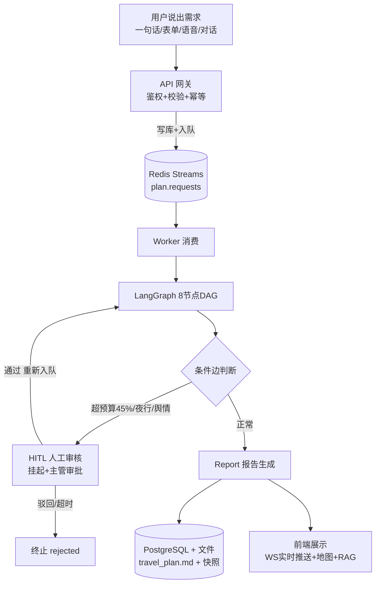
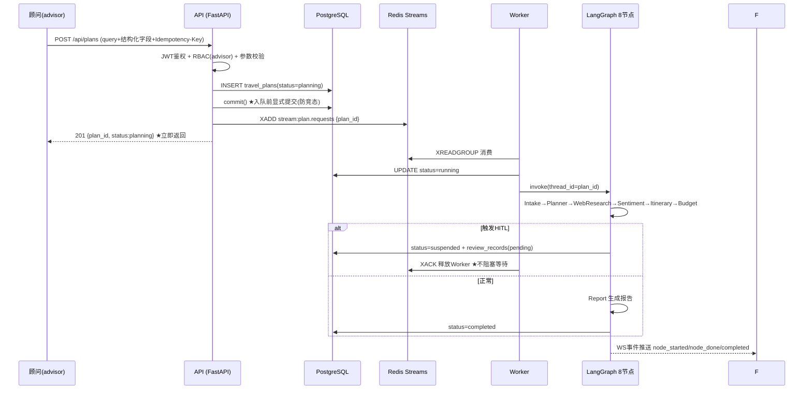
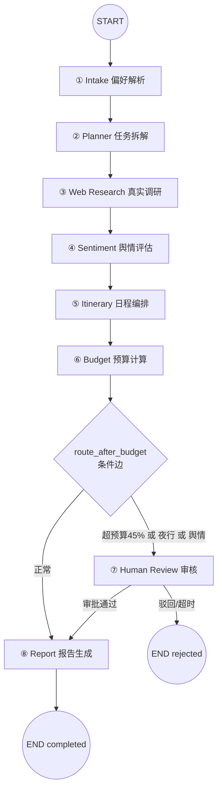
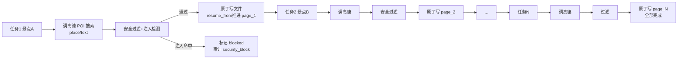
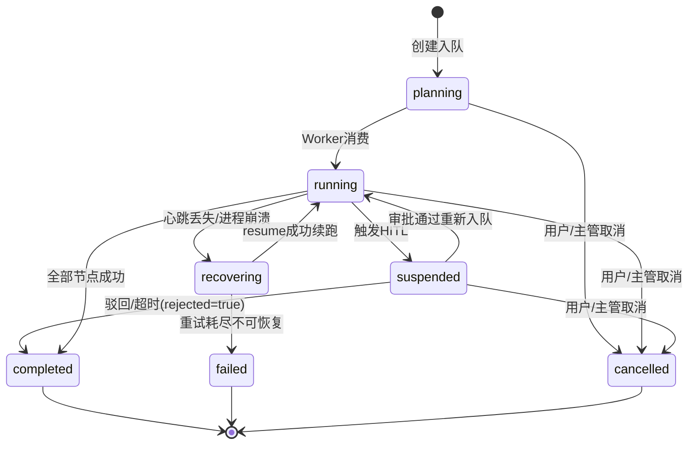
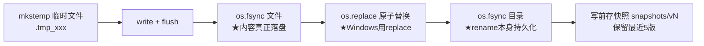
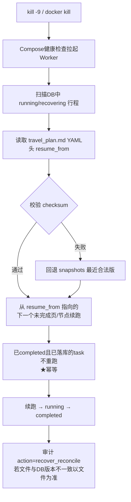
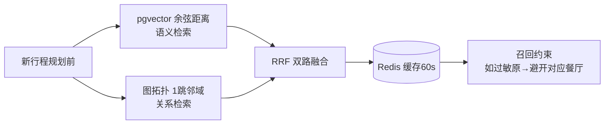
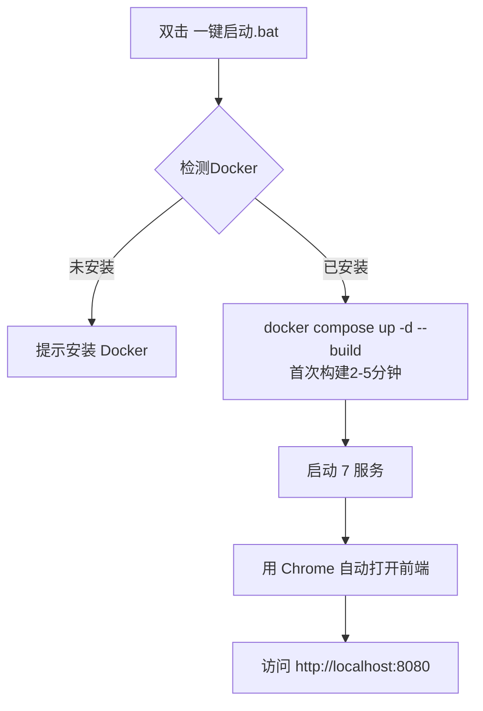

# 山海行 · 文旅多 Agent 行程规划系统 — 具体项目流程

> 版本：v1.0 ｜ 日期：2026-09-08
> 本文件完整梳理系统的核心业务流、8 Agent 协作流、审核流、状态流、恢复流、记忆干预流、RAG 流及部署运维流程。

---

## 目录

1. [流程总览](#一流程总览)
2. [核心业务流：提交需求 → 生成报告](#二核心业务流提交需求--生成报告)
3. [8 Agent 协作流程详解](#三8-agent-协作流程详解)
4. [HITL 人工审核流程](#四hitl-人工审核流程)
5. [行程状态机流转](#五行程状态机流转)
6. [断点续传与崩溃恢复流程](#六断点续传与崩溃恢复流程)
7. [图记忆与运行态强干预流程](#七图记忆与运行态强干预流程)
8. [RAG 检索增强流程](#八rag-检索增强流程)
9. [部署与启动流程](#九部署与启动流程)
10. [测试与验证流程](#十测试与验证流程)
11. [关键边界规则速查](#十一关键边界规则速查)

---

## 一、流程总览



**一句话流程**：用户输入需求 → API 入队 → Worker 跑 8 Agent DAG → 条件边决定是否人工审核 → 报告生成 → 前端实时展示。

---

## 二、核心业务流：提交需求 → 生成报告



**步骤详解**：

1. 顾问登录后提交需求（自然语言 `query` 必填，目的地/天数/预算/出行人/兴趣可选）；
2. API 校验 JWT 与角色 → 写入 `travel_plans`（`planning`）→ **显式 `db.commit()`** → `XADD` 入 Redis Streams → 立即返回 `plan_id`；
3. Worker 消费后跑完 8 个 Agent（见第三章）；
4. 若未触发 HITL，Report 生成行程单与预算表，`status=completed`；
5. 前端看板通过 WS 实时展示 `travel_plan.md`（任务列表、当前 `resume_from`、已完成页数、状态徽章）。

---

## 三、8 Agent 协作流程详解

### 3.1 DAG 拓扑



### 3.2 逐个 Agent 流程

#### ① Intake — 偏好解析

| 项 | 内容 |
|---|---|
| 输入 | 用户自然语言需求（如"从北京到云南玩7天，2大1小，预算15000，喜欢自然风光"） |
| 输出 | 结构化 preferences：出发地、目的地、天数、预算、出行人明细（成人/儿童年龄身高/老人年龄/学生）、兴趣标签 |
| 技术 | 真实 LLM + JSON Schema 结构化输出；LLM 失败降级正则解析（兜底不崩） |
| 附带 | 解析后立即做**记忆抽取**，把"我海鲜过敏"沉淀到图记忆供下次召回 |

**流程**：接收需求文本 → LLM 解析 → 校验/补全结构化字段 → 写 preferences → 抽取记忆三元组 → 进入 Planner。

#### ② Planner — 任务拆解

| 项 | 内容 |
|---|---|
| 输入 | preferences |
| 输出 | ≥10 条调研任务，每条 = 关键词 + 高德 POI 类型 |
| 技术 | CoT 思维链 + 内置调研维度模板；幂等（已拆过不重复拆） |
| 关键 | 专门拆出"早餐""快餐"关键词——早餐是独立需求，不能拿中餐厅凑数 |

**流程**：读取偏好 → CoT 拆解（约束理解→信息缺口→子任务列表 JSON）→ 写入 agent_tasks + 文件 Task List → 输出失败则规则 Fallback 种子模板（打 `quality=degraded`）。

#### ③ Web Research — 真实数据调研

| 项 | 内容 |
|---|---|
| 输入 | ≥10 条调研任务 |
| 输出 | 真实 POI 列表（名称/地址/经纬度/评分/营业时间/图片）+ 知识库检索结果 |
| 技术 | ReAct（Thought→Action fetch/search→Observation）+ 页级 checkpoint + 安全过滤 + RAG 检索注入 |

**流程（每页）**：



要点：失败标记 failed 跳过（不阻塞）；每页完成即 checkpoint；RAG 检索按"目的地+关键词"注入调研上下文。

#### ④ Sentiment — 舆情评估

| 项 | 内容 |
|---|---|
| 输入 | 全部抓取正文（**严格串行**，等 Web Research 全部完成） |
| 输出 | 每景点：评分、标签（差评/强制购物/夜行）、high_risk 标志 |
| 技术 | 规则引擎关键词打分 |

**流程**：读取全部抓取文本 → 逐景点关键词打分 → 打风险标签 → 严重负面标 `high_risk=true` → 供条件边触发 HITL。

#### ⑤ Itinerary — 日程编排（最复杂节点）

| 项 | 内容 |
|---|---|
| 输入 | preferences + 调研摘要 + 舆情结果 |
| 输出 | 每日行程（上午/下午/晚上 + 三餐）+ 往返交通 + 路线 + 门票分档 + 优待备注 |
| 技术 | 高德路径规划 + 人群过滤 + 兴趣排序 + 门票分档 + 餐饮规范 + 干预补丁读取 |

**流程**：读取偏好与调研结果 → 应用主管干预补丁（如剔除停运景点）→ 按天编排（上午/下午/晚上）→ 高德路径规划算出景点间距离耗时 → 人群过滤（老人剔高强度/儿童剔酒吧）→ 兴趣加权排序 → 门票按年龄/身高分档 → 三餐跨天去重 → 检测夜行时段。

#### ⑥ Budget — 预算计算

| 项 | 内容 |
|---|---|
| 输入 | 行程 + 价格线索 |
| 输出 | 分项预算（交通/住宿/门票/餐饮/其他）+ 总额 + over_budget_ratio |
| 技术 | 老人/儿童门票按年龄分档 + 虚拟房价按城市等级；超预算 45% 触发审核 |

**流程**：按交通/住宿/门票/餐饮/其他分项汇总 → 写 `budget_records` + 文件预算表 → 计算 `over_budget_ratio` → 交给条件边判断。

#### ⑦ Human Review — 人工审核

**只做路由，不调 LLM**。流程见第四章。

#### ⑧ Report — 报告生成

| 项 | 内容 |
|---|---|
| 输入 | 以上全部节点输出 |
| 输出 | 完整报告：概览/天气/交通/每日行程/餐饮/酒店/预算/数据来源 + RAG 目的地解读（带引用溯源） |
| 技术 | Markdown 渲染 + RAG 生成（LLM 基于检索资料生成，标注来源编号 [1][2]） |

**流程**：汇总各节点结果 → 渲染 Markdown 报告（写 `report.md` + DB）→ RAG 检索生成目的地深度解读 → 附参考来源对照表 → 置 `completed`。

### 3.3 条件边逻辑（代码级）

```python
def route_after_budget(state):
    if state.hitl_approved:        # 审批通过续跑，直接放行
        return "report"
    if state.over_budget_ratio > 0.45:   # 超预算 45%
        return "hitl"
    if state.night_risk:                 # 高危夜行 (22:00-06:00)
        return "hitl"
    if state.sentiment_risk:             # 严重舆情
        return "hitl"
    return "report"
```

---

## 四、HITL 人工审核流程

```mermaid
sequenceDiagram
    participant G as Budget 节点
    participant DB as PostgreSQL
    participant R as Redis
    participant S as 主管(supervisor)
    participant W as Worker

    G->>G: 计算 over_budget_ratio/night_risk/sentiment_risk
    alt 未触发
        G->>R2[Report 节点]
    else 触发任一风险
        G->>DB: status=suspended + review_records(pending, 记录原因与证据)
        G->>W: XACK 释放Worker ★不阻塞
        S->>DB: GET /api/reviews/pending 查看待审队列
        S->>R: POST claim → Lua CAS (Suspended→Reviewing) + 租约锁5分钟
        alt 审批通过 approved
            S->>R: XADD stream:plan.resume {plan_id, from=report}
            W->>G: 重新入队续跑(跳过已完成节点) → Report → completed
        else 驳回 rejected / 超时24h
            S->>DB: status=completed + rejected=true ★终止不重跑
        end
    end
```

**关键机制**：

| 环节 | 机制 |
|---|---|
| 触发条件 | 超预算 45% / 高危夜行（22:00–06:00 城际转移）/ 严重舆情（三者任一） |
| Worker 释放 | 挂起后 ack 当前消息，Worker 去干别的，禁止阻塞等待审批 |
| 防重复审批 | Lua CAS（Suspended→Reviewing 原子转换）+ DB `WHERE decision='pending'` 兜底 + 会话租约锁（5 分钟可续期） |
| 审批超时 | 默认 24h，超时自动终止（视为驳回）并通知顾问 |
| 驳回语义 | 终止：`completed` + `rejected=true`，不做 rework 回 Planning（顾问可复制新建） |

---

## 五、行程状态机流转



**状态说明**：

| 状态 | 含义 |
|---|---|
| planning | 已创建，待消费 |
| running | Worker 执行中 |
| suspended | 挂起等人工审核（review_records.status=pending/reviewing） |
| recovering | 崩溃恢复中 |
| completed | 完成（终态，禁止再跑图；驳回也在此态 + rejected=true） |
| failed / cancelled | 异常终态 |

**两层映射**：DB `travel_plans.status` 为主状态；`review_records.status`（pending/reviewing/approved/rejected）记录审核子状态；Redis 为热缓存，丢失后以 DB + 文件重建。

---

## 六、断点续传与崩溃恢复流程

### 6.1 原子写入（5 步保证安全）



**保证**：任何时刻崩溃，正式文件要么旧版完整、要么新版完整，绝不存在"写了一半"的文件；残留 `.tmp_*` 启动时清理。

### 6.2 崩溃恢复（recover_all）



### 6.3 队列崩溃接管

- Worker 消费消息后进入 **PEL**（pending entries list，未确认清单）；
- 若 Worker 崩溃，消息 **2 秒后**仍未 ack；
- 存活 Worker 用 **XAUTOCLAIM** 自动认领未确认消息；
- 实现"崩溃 Worker 的任务自动转给存活 Worker"，`MINIDLE 500` 认领自己的 PEL。

### 6.4 实测结果

- kill -9 后重启，从 `resume_from=page_6` 续跑，已完成任务数不变（无重复抓取）；
- Worker 就绪后 5 秒内完成 resume（口径：进程就绪可消费之后，非 Docker 冷启动）。

---

## 七、图记忆与运行态强干预流程

### 7.1 图记忆：抽取与沉淀

```mermaid
flowchart LR
    A[节点产出文本<br/>如"我香菜过敏"] --> B[LLM 抽取三元组<br/>User-[HAS_ALLERGY]-Food:香菜]
    B --> C[upsert 图节点+边<br/>命中即合并]
    C --> D[语义向量化<br/>百炼768维]
    D --> E[写 memory_events 流水]
    E --> F[(PostgreSQL<br/>graph_nodes/graph_edges)]
```

### 7.2 图记忆：跨行程召回



实测：检索 P95 0.3ms（红线 <150ms，快 500 倍）。

### 7.3 运行态强干预

```mermaid
flowchart LR
    A[主管发起干预] --> B[HMAC验签<br/>签名=HMAC(key, thread_id|nonce|sha256(patch))]
    B --> C[nonce 防重放<br/>Redis SETNX 单次有效]
    C --> D[SETNX 排他锁<br/>防并发冲突]
    D --> E[三写一事务<br/>图节点version+1 / interventions流水 / Redis补丁]
    E --> F[Agent下一节点入口<br/>读取补丁并应用<br/>如剔除停运景点]
```

**安全链路**：HMAC 验签 → nonce 防重放 → SETNX 排他锁 → 三写一事务 → 节点入口应用补丁。

---

## 八、RAG 检索增强流程

```mermaid
flowchart TD
    subgraph 入库[① 离线入库]
        A1[docs/knowledge 10篇语料] --> A2[分块 400字+50字重叠]
        A2 --> A3[百炼 text-embedding-v3<br/>768维 batch=10]
        A3 --> A4[(document_chunks 表<br/>pgvector)]
    end
    subgraph 在线[② 在线检索 Web Research + Itinerary]
        B1[查询词 目的地+关键词] --> B2[混合检索<br/>向量余弦 + BM25关键词]
        B2 --> B3[RRF 融合排序]
        B3 --> B4[rerank 精排<br/>★网关未开放则降级关键词打分]
        B4 --> B5[返回带来源 top-k chunk]
    end
    subgraph 生成[③ 增强生成 Report]
        C1[chunk 原文拼进 prompt] --> C2[LLM 生成目的地深度解读<br/>标注来源编号 [1][2]]
        C2 --> C3[报告末尾附参考来源对照表]
    end
    A4 --> B2
    B5 --> C1
```

**关键设计**：

| 环节 | 说明 |
|---|---|
| 混合检索 | 向量检索擅长语义相似（"海鲜过敏"→"对虾过敏"），BM25 擅长精确名词（"迪士尼"），RRF 取长补短 |
| 引用溯源 | 每个具体信息标注来源编号，报告末尾附对照表（如 [1] food·云南过桥米线） |
| 知识库规模 | 24 篇语料 / 181 chunk（景点22+美食28+政策13+四季16+交通12+住宿12+贴士20+夜游拍照14+城市问答44） |
| 质量评估 | Hit@1 84.6% / Hit@3 96.2% / Hit@5 98.1% / MRR 0.905（52 条测试集，含 6 条语义换问法全部命中前 2） |
| 诚实说明 | rerank 接口被当前 MaaS 网关 404，失败时降级 RRF 融合分排序；代码已实现真 rerank，网关开放后自动启用 |

---

## 九、部署与启动流程

### 9.1 一键启动（Windows）



停止：双击 `一键关闭.bat`；命令行 `.\start.ps1 -Stop`；Linux/macOS 用 `./start.sh`。

### 9.2 服务与端口（已避开本机冲突）

| 服务 | 端口 | 说明 |
|---|---|---|
| 前端看板 | http://localhost:8080 | React SPA |
| 后端 API | http://localhost:8001 | FastAPI + /docs 接口文档 |
| Redis | 6380 | 容器内 6379 |
| PostgreSQL | 5433 | 容器内 5432，含 pgvector |
| Prometheus | http://localhost:9091 | 监控指标 |
| Grafana | http://localhost:3002 | admin/admin |

### 9.3 演示账号

| 用户名 | 角色 | 密码 |
|---|---|---|
| advisor_demo | 旅行顾问（创建行程） | wenlv123 |
| supervisor_demo | 主管（审核） | wenlv123 |

### 9.4 环境变量（.env）

```
WENLV_AMAP_KEY=xxx          # 高德（地图+天气）
WENLV_AMAP_ENABLED=true
WENLV_LLM_MODE=real         # real/mock
WENLV_LLM_API_KEY=xxx       # 阿里云百炼
WENLV_LLM_MODEL=qwen3.7-flash
WENLV_JWT_SECRET=xxx
```

### 9.5 知识库入库（RAG 语料向量化）

```powershell
docker exec -w /app wenlv-api-1 sh -c "PYTHONPATH=/app python scripts/ingest_kb.py /app/knowledge"
```

---

## 十、测试与验证流程

### 10.1 测试执行流程

```powershell
cd backend

# 1. 单元测试（图记忆 + 干预）
python -m pytest tests/test_memory_intervention.py -v

# 2. 端到端联调（场景 A 正常生成 + 场景 C 注入拦截 + 场景 D HITL 审批）
python scripts/e2e_check.py

# 3. 崩溃恢复（场景 B：kill -9 后从断点续跑）
python scripts/recovery_test.py

# 4. 15 轮对话模拟 / 50 并发竞态审计
python scripts/simulate_conversation.py
python scripts/concurrent_intervention_test.py

# 5. RAG 检索延迟 + 检索质量评估
python scripts/verify_retrieve_latency.py
python scripts/eval_retrieval.py

# 6. 性能压测（20 并发 / 10 秒）
python deploy/loadtest.py 20 10
```

### 10.2 压测口径

- **主接口**：`GET /api/plans/{id}/status`（同步轻量，占压测 80%），15% 列表/详情 + 5% 创建；
- **错误定义**：HTTP 5xx + 网关超时 + 响应 code ∈ 50xxx/60xxx；不含业务 40xxx；
- **结果**：QPS 1109（≥200 ✅）、P95 35.4ms（<300ms ✅）、错误率 0.000%（<0.1% ✅）。

---

## 十一、关键边界规则速查

| # | 规则 |
|---|---|
| 1 | 预算超限：`sum(budget_records) > budget_limit × 1.45` → 挂起 `budget_over` |
| 2 | 崩溃恢复：读 `travel_plan.md` YAML `resume_from`（校验 checksum）→ 从下一未完成页续传；已 completed 的 task 不得再次请求网络 |
| 3 | 注入拦截：正文命中注入特征 → 不进入 LLM 指令区，task=blocked，审计 `security_block`，报告不得采纳注入目标 |
| 4 | 严重舆情：Sentiment 判定严重负面 → `high_risk=true` → 命中行程级风险则挂起 `sentiment_risk`；高风险景点默认不进首选 |
| 5 | LLM 降级：429/超时 → L1 指数退避 3 次（1s/2s/4s）→ L2 缓存/种子/正则（`quality=degraded`）→ L3 连续失败则 suspended/failed，禁止静默丢弃 |
| 6 | 高危夜行：行程含 22:00–06:00 高危转移 → 挂起 `risk_night` |
| 7 | 重复审批：审批记录非 pending 或 CAS 失败 → 返回 40005，不改变终态 |
| 8 | 文件损坏：checksum 失败 → 回退 snapshots 最近 5 版 → 无快照则 Redis Checkpointer → 再无则 failed |
| 9 | 提交防抖：5 秒内重复 POST 无幂等键 → `submit_lock` 拒绝，40006 |
| 10 | 审批超时：超过 `REVIEW_TIMEOUT_HOURS`（默认 24）仍 pending → 自动驳回终止 |
| 11 | 取消竞态：cancel 时 Worker 正在执行且 version 已变 → 40009 请重试；Worker 每节点开头检查 cancelled 标志 |

---

*资料来源：项目讲解 v4.0、需求与技术方案说明书 v1.0、产品介绍 v3.1、交付文档 v2.0、README.md。*
